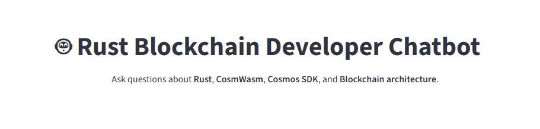

# Rust Blockchain Developer Assistant

A production oriented AI chatbot built to **assist Rust blockchain developers** in building and understanding blockchain applications, especially those using **CosmWasm**.

---

## 🖼️ Chatbot UI

## 🎥 Project Walkthrough

Watch a short walkthrough of the chatbot in action:

## Overview

Rust Blockchain Developer Assistant is designed to help developers:

- Solve Rust programming problems
- Understand and write CosmWasm smart contracts
- Learn blockchain development concepts using Rust
- Get clear explanations while building real projects

The chatbot is trained on **Rust books**, **CosmWasm documentation**, and **smart contract examples**, making it suitable for both learning and active development.

---

## What This Chatbot Can Do

- Answer advanced Rust programming questions
- Explain CosmWasm smart contract structure and logic
- Help debug Rust-related issues
- Provide guidance while developing blockchain applications
- Reference concepts from official Rust and CosmWasm resources

This is **not a beginner-only bot** — it is intended to actively assist developers while coding.

---

## Knowledge Sources

The assistant is built using curated learning material, including:

- Rust programming books and references
- CosmWasm official documentation
- CosmWasm smart contract examples
- Blockchain development resources

---

## Running the Application

Follow the steps below to run the chatbot locally.

1. Install dependencies
pip install -r requirements.txt

2. Set up environment variables
Create a .env file and add your API keys.
OPENAI_API_KEY=your_api_key_here

3. Set up the notebook kernel and build the knowledge base
Open chatbot.ipynb
Select the correct Python kernel (your virtual environment)
Run all cells to initialize the chatbot

4. Start the backend
python backend.py

5. Run the Streamlit application
streamlit run app.py

6. Access the chatbot
A URL will appear in the terminal.
Open it in your browser to use the chatbot on your local machine.

## Project Status

This project is actively evolving and is part of a larger learning and development series focused on Rust and blockchain development.

## License

MIT License

---